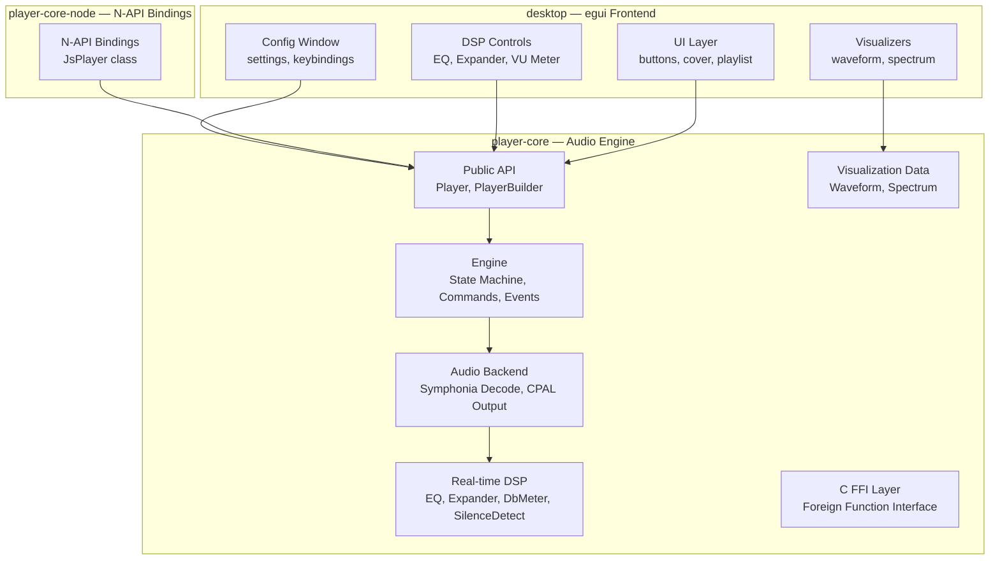

# ReAmped

Description: A high-performance audio player in Rust with real-time DSP, gapless crossfade, and a modern egui UI.

## Architecture



## Prerequisites

- Rust 2024 edition (MSRV)
- Linux: `libasound2-dev` (ALSA) or `pipewire-jack`
- macOS: CoreAudio (built-in)
- Windows: WASAPI (built-in)

## Build

```bash
# Player core library
cargo build --release -p player_core

# Desktop UI application
cargo build --release -p ReAmped

# Node.js bindings
cargo build --release -p player-core-node

# Generate documentation
cargo doc --no-deps --document-private-items -p player_core
```

## Run

```bash
cargo run --release -p ReAmped
```

## Project Structure

### `player-core` (core library)

| Module | Description |
|--------|-------------|
| `api` | Public API: `Player` handle, `PlayerBuilder` |
| `engine` | State machine, command/event bus, track management |
| `audio` | Symphonia decoding, CPAL output, crossfade logic |
| `dsp` | Real-time DSP: 3-band EQ, stereo expander, VU meter, silence detector |
| `viz` | Oscilloscope waveform and FFT spectrum analyzers |
| `ffi` | C-compatible FFI layer for embedding in other languages |
| `config` | TOML configuration management |
| `metadata` | Audio file metadata reading via Lofty |
| `keybindings` | Configurable keyboard shortcuts |

### `desktop` (UI application)

| Module | Description |
|--------|-------------|
| `player` | Application state & egui `App` trait implementation |
| `ui_elements` | Reusable widgets: buttons, cover, playlist, volume bar, settings |
| `utils` | Helpers: background gradients, visualizers, MPRIS, font setup |
| `dsp_ui` | DSP controls: EQ sliders, expander knob, VU meter display |

### `player-core-node` (Node.js bindings)

Exposes a `JsPlayer` class via N-API with transport controls, playlist management, EQ settings, and event callbacks.

## Configuration

Config file: `~/.config/reamped/config.toml`

```toml
volume = 1.0
fullscreen = false
crossfade_enabled = true
crossfade_seconds = 6.0
silence_trim_enabled = true

[theme]
follow_cover = true
base_scale = 1.0
pallete_custom = [[36, 36, 36], [209, 209, 209], [140, 140, 140]]
```

## License

GPL 3.0
